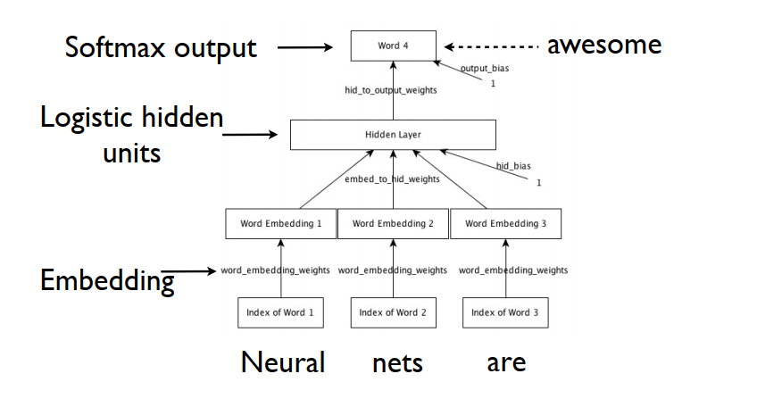

# Trigram-Based Word Prediction using Neural Networks

## Introduction
Neural network architectures can produce powerful computational models for natural language processing. Here, we consider one particular model for examining sequences of words. The task is to predict the fourth word in a sequence given the preceding trigram, e.g., `"Neural nets are"`, fourth word: `"awesome"`. A database of articles is prepared to store sample trigrams restricted to a vocabulary size of 250 words. The file `data.h5` contains training samples for input and output (`trainX`, `trainY`), for validation (`valX`, `valY`), and for testing (`testX`, `testY`). Using these samples, the following network should be trained via backpropagation:

The input layer has 3 neurons corresponding to the trigram entries. An embedding matrix $R$ ($250 \times D$) is used to linearly map each single word onto a vector representation of length $D$. The same embedding matrix is used for each input word in the trigram, without considering the sequence order. The hidden layer uses a sigmoidal activation function on each of $P$ hidden-layer neurons. The output layer predicts a separate response $z_i$ for each of 250 vocabulary words, and the probability of each word is estimated via a softmax operation:

\$
\sigma_i = \frac{e^{z_i}}{\sum_{j=1}^{250} e^{z_j}}.
\$

## Tasks

### a) Training the Model
- Stochastic gradient descent algorithm
- Mini-batch size of 200 samples
- Learning rate $\eta = 0.15$
- Momentum rate $c = 0.85$
- Maximum of 50 epochs
- Weights and biases initialized as random Gaussian variables of std 0.01

Adjusting parameters to improve network performance. The algorithm is based on the cross-entropy error on the validation data. Experimented with different $D$ and $P$ values, $(D, P) = \{(32, 256), (16, 128), (8, 64)\}$.

### b) Testing the Model
Predictions for the fourth word are generated for test trigrams, storing the top 5 probabilities. For 5 samples, the top 10 candidates are listed and analyzed for sensibility.
